# OFP 1.0.0 Agent Integration Guide

This guide explains how agents integrate with the Floor Manager following the Open Floor Protocol 1.0.0 specification.

## Overview

According to OFP 1.0.0, agents must:
1. **Register their manifest** (capabilities and identification)
2. **Request floor** before speaking (using `requestFloor` event)
3. **Receive floor grant** (via `grantFloor` event)
4. **Send messages** via conversation envelopes
5. **Yield floor** when done (using `yieldFloor` event)

## Integration Flow Diagram

```mermaid
sequenceDiagram
    participant Agent as Agent
    participant Registry as Agent Registry
    participant FloorMgr as Floor Manager
    participant Router as Envelope Router
    participant OtherAgent as Other Agent

    Note over Agent,OtherAgent: Step 1: Agent Registration
    Agent->>Registry: POST /api/v1/agents/register<br/>(manifest: speakerUri, serviceUrl, capabilities)
    Registry-->>Agent: ✅ Registration confirmed
    
    Note over Agent,OtherAgent: Step 2: Request Floor
    Agent->>FloorMgr: POST /api/v1/floor/request<br/>(conversation_id, speakerUri, priority)
    alt Floor Available
        FloorMgr-->>Agent: ✅ Floor granted immediately
    else Floor Busy
        FloorMgr-->>Agent: ⏳ Queued (position: N)
        FloorMgr->>Agent: Envelope: grantFloor event<br/>(when floor available)
    end
    
    Note over Agent,OtherAgent: Step 3: Send Message
    Agent->>Router: POST /api/v1/envelopes/send<br/>(utterance envelope)
    Router->>OtherAgent: Forward envelope<br/>(to serviceUrl)
    OtherAgent-->>Router: Envelope received
    
    Note over Agent,OtherAgent: Step 4: Yield Floor
    Agent->>FloorMgr: POST /api/v1/floor/release<br/>(conversation_id, speakerUri)
    FloorMgr-->>Agent: ✅ Floor released
    FloorMgr->>OtherAgent: Envelope: grantFloor event<br/>(next in queue)
```



## Agent Lifecycle Diagram

```mermaid
stateDiagram-v2
    [*] --> Unregistered: Agent starts
    
    Unregistered --> Registering: Register manifest
    Registering --> Registered: ✅ Registration confirmed
    
    Registered --> RequestingFloor: Request floor
    RequestingFloor --> FloorGranted: ✅ Floor available
    RequestingFloor --> Queued: ⏳ Floor busy
    
    Queued --> FloorGranted: Next in queue
    
    FloorGranted --> Speaking: Send utterance
    Speaking --> FloorGranted: More messages
    Speaking --> YieldingFloor: Done speaking
    
    YieldingFloor --> Registered: Floor released
    
    Registered --> Unregistered: Unregister
    Unregistered --> [*]: Agent stops
```



## Step-by-Step Integration Flow

### Step 1: Agent Registration (Manifest Publication)

**OFP 1.0.0 Requirement**: Agents must publish their manifest to enable capability discovery.

#### What is a Manifest?

A manifest contains:
- **speakerUri**: Unique, persistent identifier (Tag URI format)
- **serviceUrl**: Where the agent can receive envelopes
- **Capabilities**: What the agent can do (text generation, image processing, etc.)
- **Metadata**: Organization, role, synopsis, etc.

#### Registration Process

```python
# Agent creates its capabilities manifest
capabilities = {
    "speakerUri": "tag:example.com,2025:my_agent",
    "serviceUrl": "http://localhost:8001",
    "agent_name": "My LLM Agent",
    "capabilities": ["text_generation"],
    "organization": "Example Corp",
    "role": "Assistant"
}

# Register with Floor Manager
POST /api/v1/agents/register
{
    "speakerUri": "tag:example.com,2025:my_agent",
    "serviceUrl": "http://localhost:8001",
    "agent_name": "My LLM Agent",
    "capabilities": ["text_generation"],
    "organization": "Example Corp",
    "role": "Assistant"
}
```

**OFP Compliance**: This implements the `publishManifests` event pattern.

#### Example Code

```python
import httpx

async def register_agent():
    async with httpx.AsyncClient() as client:
        response = await client.post(
            "http://localhost:8000/api/v1/agents/register",
            json={
                "speakerUri": "tag:example.com,2025:my_agent",
                "serviceUrl": "http://localhost:8001",
                "agent_name": "My LLM Agent",
                "capabilities": ["text_generation"],
                "agent_version": "1.0.0"
            }
        )
        return response.json()
```

### Step 2: Floor Request (requestFloor Event)

**OFP 1.0.0 Requirement**: Agents must request floor before speaking in a conversation.

#### Why Floor Control?

Floor control ensures:
- Only one agent speaks at a time
- Orderly turn-taking
- Priority-based access
- Conflict resolution

#### Requesting Floor

**Current Implementation (REST API - Convenience Layer):**
```python
POST /api/v1/floor/request
{
    "conversation_id": "conv_001",
    "speakerUri": "tag:example.com,2025:my_agent",
    "priority": 5
}
```

**Fully OFP-Compliant (Envelope-Based):**
According to OFP 1.0.0, this should be done via conversation envelope:

```python
# Create envelope with requestFloor event
envelope = {
    "openFloor": {
        "schema": {"version": "1.0.0"},
        "conversation": {"id": "conv_001"},
        "sender": {
            "speakerUri": "tag:example.com,2025:my_agent",
            "serviceUrl": "http://localhost:8001"
        },
        "events": [{
            "eventType": "requestFloor",
            "parameters": {
                "priority": 5,
                "reason": "Need to respond to user question"
            }
        }]
    }
}

POST /api/v1/envelopes/send
{
    "envelope": envelope
}
```

#### Floor Request Response

**If granted immediately:**
```json
{
    "conversation_id": "conv_001",
    "granted": true,
    "holder": "tag:example.com,2025:my_agent"
}
```

**If queued:**
```json
{
    "conversation_id": "conv_001",
    "granted": false,
    "holder": "tag:example.com,2025:other_agent",
    "queue_position": 2
}
```

### Step 3: Receiving Floor Grant (grantFloor Event)

**OFP 1.0.0 Requirement**: Floor Manager sends `grantFloor` event to agent.

#### How Agents Receive Grants

**Current Implementation**: Agents poll or check floor status
```python
GET /api/v1/floor/holder/conv_001
```

**Fully OFP-Compliant**: Agent receives envelope with `grantFloor` event
```json
{
    "openFloor": {
        "schema": {"version": "1.0.0"},
        "conversation": {"id": "conv_001"},
        "sender": {
            "speakerUri": "tag:floor-manager.com,2025:floor_manager",
            "serviceUrl": "http://localhost:8000"
        },
        "events": [{
            "to": {
                "speakerUri": "tag:example.com,2025:my_agent",
                "serviceUrl": "http://localhost:8001"
            },
            "eventType": "grantFloor",
            "parameters": {
                "conversation_id": "conv_001",
                "granted_at": "2025-12-23T17:30:00Z"
            }
        }]
    }
}
```

**Agent must listen on `serviceUrl`** to receive these envelopes.

### Step 4: Sending Messages (utterance Event)

**OFP 1.0.0 Requirement**: Agents send messages via conversation envelopes.

#### Only Floor Holder Can Speak

Before sending, agent must verify it has the floor:
```python
# Check if agent has floor
GET /api/v1/floor/holder/conv_001
# Response: {"holder": "tag:example.com,2025:my_agent"}
```

#### Sending Utterance

**Current Implementation (REST API - Convenience Layer):**
```python
POST /api/v1/envelopes/utterance
{
    "conversation_id": "conv_001",
    "sender_speakerUri": "tag:example.com,2025:my_agent",
    "target_speakerUri": "tag:example.com,2025:other_agent",
    "text": "Hello! Can you help me?"
}
```

**Fully OFP-Compliant (Envelope-Based):**
```python
envelope = {
    "openFloor": {
        "schema": {"version": "1.0.0"},
        "conversation": {"id": "conv_001"},
        "sender": {
            "speakerUri": "tag:example.com,2025:my_agent",
            "serviceUrl": "http://localhost:8001"
        },
        "events": [{
            "to": {
                "speakerUri": "tag:example.com,2025:other_agent",
                "serviceUrl": "http://localhost:8002"
            },
            "eventType": "utterance",
            "parameters": {
                "dialogEvent": {
                    "speakerUri": "tag:example.com,2025:my_agent",
                    "features": {
                        "text": {
                            "mimeType": "text/plain",
                            "tokens": [
                                {"token": "Hello! Can you help me?"}
                            ]
                        }
                    }
                }
            }
        }]
    }
}

POST /api/v1/envelopes/send
{
    "envelope": envelope
}
```

### Step 5: Yielding Floor (yieldFloor Event)

**OFP 1.0.0 Requirement**: Agent releases floor when done speaking.

#### Yielding Floor

**Current Implementation (REST API - Convenience Layer):**
```python
POST /api/v1/floor/release
{
    "conversation_id": "conv_001",
    "speakerUri": "tag:example.com,2025:my_agent"
}
```

**Fully OFP-Compliant (Envelope-Based):**
```python
envelope = {
    "openFloor": {
        "schema": {"version": "1.0.0"},
        "conversation": {"id": "conv_001"},
        "sender": {
            "speakerUri": "tag:example.com,2025:my_agent",
            "serviceUrl": "http://localhost:8001"
        },
        "events": [{
            "eventType": "yieldFloor",
            "parameters": {
                "conversation_id": "conv_001",
                "reason": "Finished responding"
            }
        }]
    }
}

POST /api/v1/envelopes/send
{
    "envelope": envelope
}
```

## Complete Agent Integration Architecture


## Complete OFP-Compliant Agent Flow

### 1. Agent Startup

```python
# 1. Register manifest
await register_agent()

# 2. Start listening on serviceUrl for envelopes
# (This would typically be a webhook endpoint)
```

### 2. Joining a Conversation

```python
# 1. Request floor
envelope = create_request_floor_envelope("conv_001", priority=5)
await send_envelope(envelope)

# 2. Wait for grantFloor event
# (Received via webhook on serviceUrl)
grant_envelope = await receive_envelope()  # Contains grantFloor event

# 3. Now agent has floor - can speak
```

### 3. Speaking in Conversation

```python
# 1. Verify floor (optional but recommended)
holder = await get_floor_holder("conv_001")
assert holder == my_speaker_uri

# 2. Send utterance envelope
utterance_envelope = create_utterance_envelope(
    conversation_id="conv_001",
    target_speaker_uri="tag:example.com,2025:other_agent",
    text="Hello!"
)
await send_envelope(utterance_envelope)
```

### 4. Yielding Floor

```python
# When done speaking
yield_envelope = create_yield_floor_envelope("conv_001")
await send_envelope(yield_envelope)

# Floor Manager processes queue and grants to next agent
```

## Implementation Comparison


## Current Implementation vs Full OFP Compliance

### Current Implementation (REST API Convenience Layer)

**Pros:**
- ✅ Easier to use
- ✅ Faster to implement
- ✅ Familiar REST API pattern

**Cons:**
- ⚠️ Not fully OFP-compliant
- ⚠️ Uses REST instead of envelope events
- ⚠️ Less interoperable

**Usage:**
```python
# Direct REST calls
POST /api/v1/floor/request
POST /api/v1/envelopes/utterance
POST /api/v1/floor/release
```

### Fully OFP-Compliant (Envelope-Based)

**Pros:**
- ✅ Fully compliant with OFP 1.0.0
- ✅ Interoperable with other OFP implementations
- ✅ All communication via envelopes

**Cons:**
- ⚠️ More complex
- ⚠️ Requires envelope handling
- ⚠️ Requires webhook/callback mechanism

**Usage:**
```python
# All via envelopes
POST /api/v1/envelopes/send
# With envelope containing requestFloor/grantFloor/yieldFloor events
```

## Agent Manifest Structure (OFP 1.0.0)

According to OFP Assistant Manifest Specification:

```json
{
    "speakerUri": "tag:example.com,2025:my_agent",
    "serviceUrl": "http://localhost:8001",
    "agent_name": "My LLM Agent",
    "agent_version": "1.0.0",
    "capabilities": [
        "text_generation",
        "image_generation"
    ],
    "organization": "Example Corp",
    "conversationalName": "Assistant",
    "department": "AI Research",
    "role": "Conversational AI",
    "synopsis": "A helpful AI assistant for multi-agent conversations"
}
```

## Floor Control State Machine


## Floor Control Events (OFP 1.0.0)

### requestFloor Event

```json
{
    "eventType": "requestFloor",
    "parameters": {
        "priority": 5,
        "reason": "Need to respond to user question",
        "timeout": 30
    }
}
```

### grantFloor Event

```json
{
    "eventType": "grantFloor",
    "to": {
        "speakerUri": "tag:example.com,2025:my_agent"
    },
    "parameters": {
        "conversation_id": "conv_001",
        "granted_at": "2025-12-23T17:30:00Z",
        "expires_at": "2025-12-23T17:30:30Z"
    }
}
```

### yieldFloor Event

```json
{
    "eventType": "yieldFloor",
    "parameters": {
        "conversation_id": "conv_001",
        "reason": "Finished responding"
    }
}
```

### revokeFloor Event

```json
{
    "eventType": "revokeFloor",
    "to": {
        "speakerUri": "tag:example.com,2025:my_agent"
    },
    "parameters": {
        "conversation_id": "conv_001",
        "reason": "Timeout exceeded"
    }
}
```

## Capability Discovery Flow


## Capability Discovery (OFP 1.0.0)

### Finding Agents by Capability

**OFP Requirement**: Use `getManifests` event pattern

**Current Implementation:**
```python
GET /api/v1/agents/capability/text_generation
```

**Response:**
```json
[
    {
        "speakerUri": "tag:example.com,2025:agent1",
        "capabilities": ["text_generation"],
        "serviceUrl": "http://localhost:8001"
    },
    {
        "speakerUri": "tag:example.com,2025:agent2",
        "capabilities": ["text_generation", "image_generation"],
        "serviceUrl": "http://localhost:8002"
    }
]
```

## Complete Example: OFP-Compliant Agent

```python
import httpx
import asyncio
from src.envelope_router.envelope import (
    OpenFloorEnvelope,
    SchemaObject,
    ConversationObject,
    SenderObject,
    EventObject,
    EventType,
    ToObject
)

class OFPCompliantAgent:
    def __init__(self, speaker_uri: str, service_url: str):
        self.speaker_uri = speaker_uri
        self.service_url = service_url
        self.floor_api_url = "http://localhost:8000"
        self.client = httpx.AsyncClient()
    
    async def register(self):
        """Step 1: Register manifest"""
        response = await self.client.post(
            f"{self.floor_api_url}/api/v1/agents/register",
            json={
                "speakerUri": self.speaker_uri,
                "serviceUrl": self.service_url,
                "agent_name": "OFP Compliant Agent",
                "capabilities": ["text_generation"],
                "agent_version": "1.0.0"
            }
        )
        return response.json()
    
    async def request_floor_via_envelope(self, conversation_id: str, priority: int = 5):
        """Step 2: Request floor via OFP envelope"""
        envelope = OpenFloorEnvelope(
            schema_obj=SchemaObject(version="1.0.0"),
            conversation=ConversationObject(id=conversation_id),
            sender=SenderObject(
                speakerUri=self.speaker_uri,
                serviceUrl=self.service_url
            ),
            events=[
                EventObject(
                    eventType=EventType.REQUEST_FLOOR,
                    parameters={
                        "priority": priority,
                        "reason": "Need to speak"
                    }
                )
            ]
        )
        
        response = await self.client.post(
            f"{self.floor_api_url}/api/v1/envelopes/send",
            json=envelope.to_dict()
        )
        return response.json()
    
    async def send_utterance_via_envelope(
        self,
        conversation_id: str,
        target_speaker_uri: str,
        text: str
    ):
        """Step 4: Send utterance via OFP envelope"""
        envelope = OpenFloorEnvelope(
            schema_obj=SchemaObject(version="1.0.0"),
            conversation=ConversationObject(id=conversation_id),
            sender=SenderObject(
                speakerUri=self.speaker_uri,
                serviceUrl=self.service_url
            ),
            events=[
                EventObject(
                    to=ToObject(speakerUri=target_speaker_uri),
                    eventType=EventType.UTTERANCE,
                    parameters={
                        "dialogEvent": {
                            "speakerUri": self.speaker_uri,
                            "features": {
                                "text": {
                                    "mimeType": "text/plain",
                                    "tokens": [{"token": text}]
                                }
                            }
                        }
                    }
                )
            ]
        )
        
        response = await self.client.post(
            f"{self.floor_api_url}/api/v1/envelopes/send",
            json=envelope.to_dict()
        )
        return response.json()
    
    async def yield_floor_via_envelope(self, conversation_id: str):
        """Step 5: Yield floor via OFP envelope"""
        envelope = OpenFloorEnvelope(
            schema_obj=SchemaObject(version="1.0.0"),
            conversation=ConversationObject(id=conversation_id),
            sender=SenderObject(
                speakerUri=self.speaker_uri,
                serviceUrl=self.service_url
            ),
            events=[
                EventObject(
                    eventType=EventType.YIELD_FLOOR,
                    parameters={
                        "conversation_id": conversation_id,
                        "reason": "Finished speaking"
                    }
                )
            ]
        )
        
        response = await self.client.post(
            f"{self.floor_api_url}/api/v1/envelopes/send",
            json=envelope.to_dict()
        )
        return response.json()

# Usage
async def main():
    agent = OFPCompliantAgent(
        speaker_uri="tag:example.com,2025:ofp_agent",
        service_url="http://localhost:8001"
    )
    
    # 1. Register
    await agent.register()
    
    # 2. Request floor
    await agent.request_floor_via_envelope("conv_001", priority=5)
    
    # 3. Wait for grantFloor (would be received via webhook)
    # ... (in real implementation, agent listens on serviceUrl)
    
    # 4. Send message
    await agent.send_utterance_via_envelope(
        "conv_001",
        "tag:example.com,2025:other_agent",
        "Hello!"
    )
    
    # 5. Yield floor
    await agent.yield_floor_via_envelope("conv_001")

asyncio.run(main())
```

## Summary: OFP Compliance Checklist

### ✅ Currently Implemented

- [x] Agent manifest registration
- [x] Floor request mechanism
- [x] Floor grant/release
- [x] Conversation envelope structure
- [x] Event types (requestFloor, grantFloor, yieldFloor, revokeFloor)
- [x] Capability discovery
- [x] SpeakerUri/ServiceUrl identification

### ⚠️ Partial Compliance

- [ ] Floor control via envelope events (currently REST API)
- [ ] Webhook mechanism for receiving grantFloor events
- [ ] Full envelope-based communication

### 📝 Notes

- **Current approach**: REST API convenience layer (easier, faster)
- **Full compliance**: Envelope-based communication (more complex, fully interoperable)
- **Both can coexist**: Use REST for development, envelopes for production/interoperability

## See Also

- `docs/OFP_COMPLIANCE.md` - Detailed compliance status
- `examples/agents/demo_agents.py` - Current REST API approach
- `src/envelope_router/envelope.py` - Envelope structure
- `src/floor_manager/floor_control.py` - Floor control implementation

